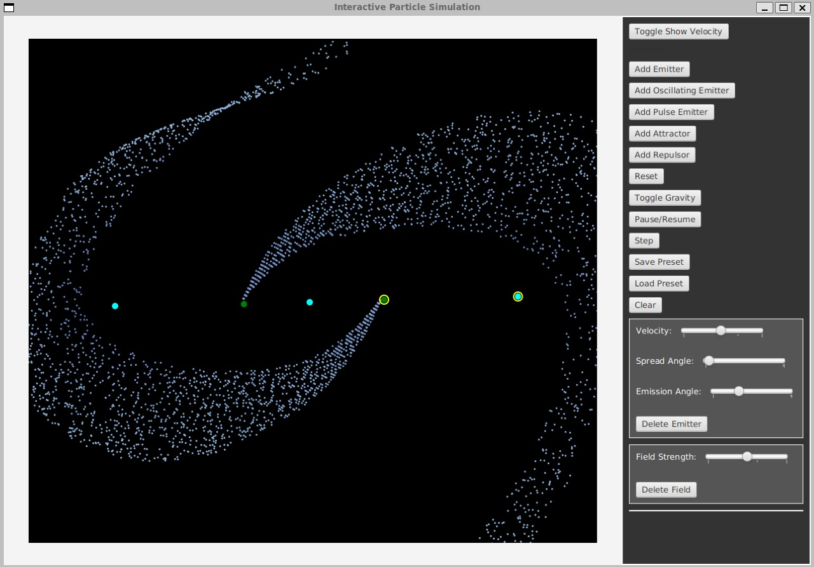
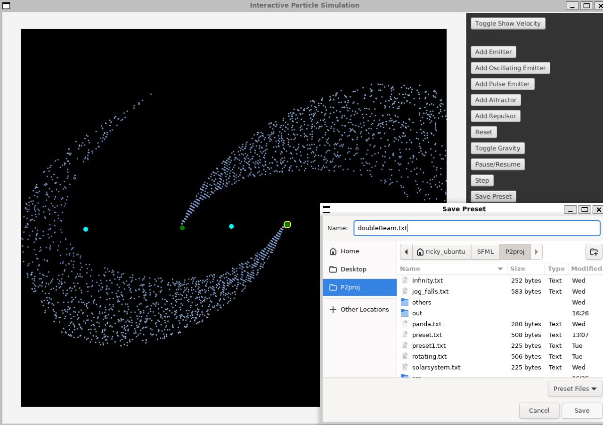
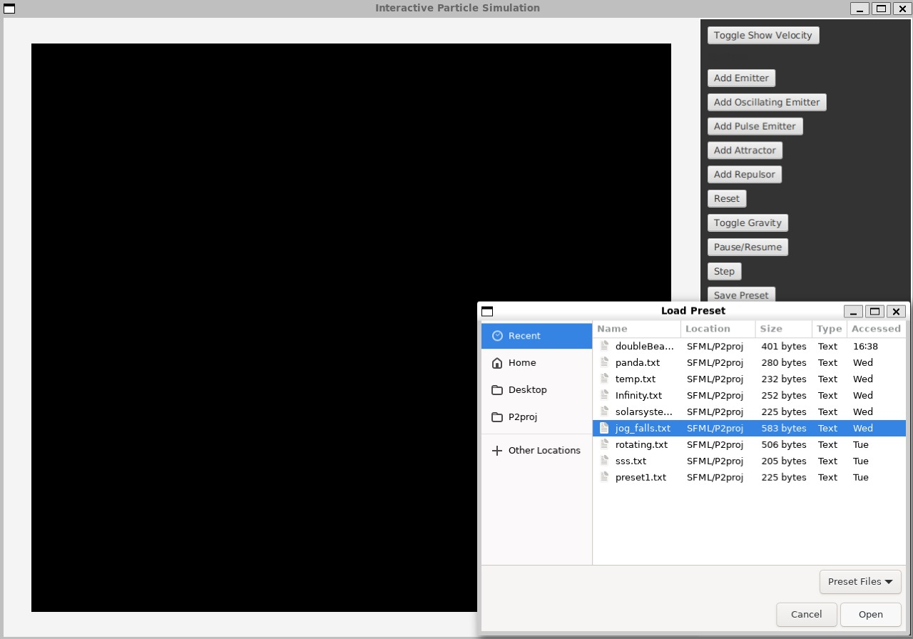

<div align="center">
  <h1 align="center">Particle Simulator</h1>

  <p align="center">
    The Particle Simulator enables users to customize and explore particle and emitter behaviors, fields, and interactions for dynamic, real-time simulations.
    <br />    
  </p>
</div>


## About the Project


|  |  |
|-------------------------------|-------------------------------|
| Different emitters            | Some cool presets       |
|  |  |
| Save preset                  | Load Preset                  |


The **Particle System Simulator** is an interactive, real-time application designed to explore the dynamics of particle systems. It provides users with extensive customization options for particle and emitter behaviors, including emission rates, velocities, masses, charges, and interactions with fields. The simulator is tailored for both educational and creative purposes, offering a platform for students to learn about particle dynamics and for designers to experiment with complex visual effects.

### Key Features:
- **Emitters**: Add, configure, and position emitters with customizable properties such as particle spread, angle, and special behaviors (oscillator, pulse, etc.).
- **Field Points**: Create and manipulate attractive or repulsive field points to influence particle movement dynamically.

- **Environment Controls**: Adjust gravity, colours for speed, or observe particle interactions frame by frame.
- **Preset Management**: Load predefined system setups or save custom configurations for reuse or sharing.
  
### Built with  
Built with **JavaFX** for an intuitive UI and a **C++** backend for efficient physics calculations, the simulator uses **JNI** to call the cpp methods that handle the computationally intensive tasks from the java code files to deliver high-performance real-time visualizations.


## Getting Started

This is an example of how you may give instructions on setting up your project locally.
Currently we have put the instructions for setting up the project on ubuntu.
To get a local copy up and running follow these simple example steps.

### Prerequisites

Install JavaFX from gluon using this link (Note: The below link will start the download of the zip file, click on the link only on ubuntu)
https://download2.gluonhq.com/openjfx/21.0.5/openjfx-21.0.5_linux-x64_bin-sdk.zip

Unzip and extract the folder
Also java, g++ and JNI needs to be installed

### Installation

_Below is an example of how you can instruct your audience on installing and setting up your app. This template doesn't rely on any external dependencies or services._

1. Clone the repo
   ```sh
   https://github.com/Subhashhari/Particle_simulator.git
   ```
2. Change the path to JAVAFX_LIB in the Makefile based on your system

3. Clean the build directory
    ```sh
   make clean
   ```
4. Compile the program
    ```sh
   make
   ```
5. Run the program
   ```sh
   make run
   ```


## Usage

The Particle Simulator is a powerful tool designed for visualizing and experimenting with particle systems. Follow these steps to get started:

### 1. Launch the Application
- Run the program using Makefile to start the simulator.
- Ensure all necessary libraries (JavaFX, JNI bindings) are installed and configured.

### 2. Adding Emitters
- Click **"Add Emitter"** to create a new particle emitter.
- Configure emitter properties such as:
  - **Position**: Drag the emitter to the desired location.
  - **Angle**: Control the angle of emission.
  - **Spread**: Adjust the spread of emission.


### 3. Adding Fields
- Click **"Add Attractor"** to create attractive fields.
- Click **"Add Repulsor"** to create repulsive fields.
- Modify properties like:
  - **Field Strength**: Define how strongly the field influences nearby particles.

### 4. Configuring Particles
- Customize particle properties for each emitter, such as:
  - **Mass**: Affects how particles respond to forces.
  - **Charge**: Alters interactions with fields.
  - **Velocity**: Adjust initial speed and direction.
 

### 5. Managing Environment Settings
- Modify global settings to influence the entire simulation:
  - **Gravity**: Toggle gravity on/off and set its strength.
  - **Maximum Number of particles**: Can set the maximum number of particles that can be on the screen at a given time.
  - **Colours for particles**: When Show velocities is clicked on the colours for particles is shown based on the speed of the particles.

### 6. Saving and Loading Presets
- Use **"Save Preset"** to store your current simulation setup.
- Load previously saved presets to revisit experiments or share configurations with others.
- Recently loaded presets appear at the bottom on a separate panel for quick access.

### 7. Advanced Features
- **Step-by-Step Simulation**: Pause the simulation and step through it frame by frame to analyze particle interactions.
- **Custom Behaviors**: Define oscillating emitters, pulsing particles, or other unique behaviors using the property editor.

### 8. Data Flow and Internal Workings

This section explains how user interactions translate into system operations:

1. **User Interaction**:  
   - Users interact with the UI through actions like adding emitters or adjusting sliders.
   - These actions call methods in `SimulationUI`, such as `addEmitter` or `updateSliders`.

2. **Emitter and Particle Generation**:  
   - Emitters generate particles dynamically and call native C++ methods like `getVelocities()` to calculate particle velocities.

3. **Particle System Updates**:  
   - Particles are added to the `ParticleSystem` using methods like `addParticles()`.
   - The `ParticleSystem` applies forces to particles via `setForces()` (C++) and updates their positions with `Particle.update()` (C++).

4. **Rendering**:  
   - The updated particle system is rendered using JavaFX's `GraphicsContext` in `SimulationUI`.

5. **Preset Management**:  
   - Presets are managed by `SystemPreset`, which saves and loads simulation states from files, affecting `ParticleSystem` and its components.

---


## Roadmap

### Phase 1: Core Features
1. **Basic Particle System**  
   - Implement particle attributes: mass, velocity, charge, and color.  
   - Create a particle rendering system using JavaFX.  
   - Add basic interactions with field points and gravity.  

2. **Emitters**  
   - Develop standard emitters with configurable properties: position, speed, spread, and angle.  
   - Enable emitters to produce particles continuously.  

3. **Field Points**  
   - Implement attractor and repulsor field points with adjustable field strength.  
   - Add drag-and-drop functionality for positioning field points on the canvas.  

4. **Environment Controls**  
   - Integrate gravity toggle and basic boundary conditions (e.g., particles disappearing at edges).  
   - Provide frame-by-frame control for detailed observation.  

5. **Preset Management**  
   - Enable loading and saving of particle system configurations.  
   - Add predefined presets for quick simulation setups.  

---

### Phase 2: Enhanced Features
1. **Special Emitters**  
   - Develop advanced emitter types like Oscillating and Pulse emitters with unique behaviors.  
   - Allow real-time modification of emitter properties.

2. **Dynamic Particle Properties**  
   - Add dynamic color changes based on particle velocity or acceleration.  
   - Introduce sliders for fine-tuning particle attributes.  

3. **Environment Enhancements**  
   - Expand boundary conditions: particles that leave the screen are deleted from memory to enable efficient rendering.  

4. **UI/UX Improvements**  
   - Create an intuitive and visually appealing interface with JavaFX.  
   - Provide real-time feedback, changing any setting will immediately reflect in change of particle behavior.  

---

### Phase 3: Scalability and Optimization
1. **Performance Enhancements**  
   - Optimize the C++ backend for handling large particle counts while maintaining high FPS.  
   - Utilize JNI efficiently for smooth communication between JavaFX and C++.  

2. **Advanced Preset Management**  
   - Enable exporting and sharing of presets for collaborative experimentation.  
   - Add the ability to load presets dynamically from external files.  

---

### Future Scope (Post-MVP)
1. **Advanced Physics**  
   - Add support for inter-particle interactions and advanced collision detection.  

2. **Visual Effects**  
   - Introduce particle trails, gradients, and enhanced visual effects for artistic simulations.  

3. **Extended Compatibility**  
   - Explore cross-platform support for web-based or mobile versions (if feasible).  

## Acknowledgements

We would like to express our gratitude to the Prof. Vivek Yadav, Prof. Ajay Bakre and the TAs for resolving our doubts and errors during the development of the project.


- **Libraries and Tools**  
  - **JavaFX**: For providing a robust framework for building the user interface and rendering the simulation.  
  - **C++**: For enabling high-performance physics calculations and backend support.  
  - **JNI (Java Native Interface)**: For seamless communication between the Java and C++ code files.  

- **Open Source Community**  
  - For the wealth of resources, documentation, and tutorials available, which helped us overcome technical challenges.  

- **Team Members**  
  - A special thanks to each team member for their dedication and collaboration in bringing this project to life:  
    - **Sathish Adithiyaa SV** (IMT2023030) 
    - **R. Ricky Roger** (IMT2023098)   
    - **Rakshith Srinivasan** (IMT2023544)  
    - **Subhash H** (IMT2023104)  
    - **Pranav Sandeep** (IMT2023058)  
    - **Bharat Dhulgond** (IMT2023504)

- **Community Support**  
  - A huge thanks to the programming forums and developer communities, such as Stack Overflow, for their invaluable assistance and discussions.

This project wouldn’t have been possible without the collective efforts and contributions of everyone mentioned above. Thank you!


## Contributors

Thanks to all the amazing contributors who helped build this project!

|  |  |  |  |  |  |
|:-------------------------------------------------------------------:|:----------------------------------------------------------:|:--------------------------------------------------------------:|:------------------------------------------------------------------:|:---------------------------------------------------------------:|:------------------------------------------------------------:|
| [Rakshith Srinivasan](https://github.com/rakshithsrinivasan)        | [Subhash H](https://github.com/subhashh)                   | [R. Ricky Roger](https://github.com/rrickyroger)               | [Sathish Adithiyaa SV](https://github.com/sathishadithiyaa)        | [Pranav Sandeep](https://github.com/pranavsandeep)             | [Bharat Dhulgond](https://github.com/bharatdhulgond)            |
